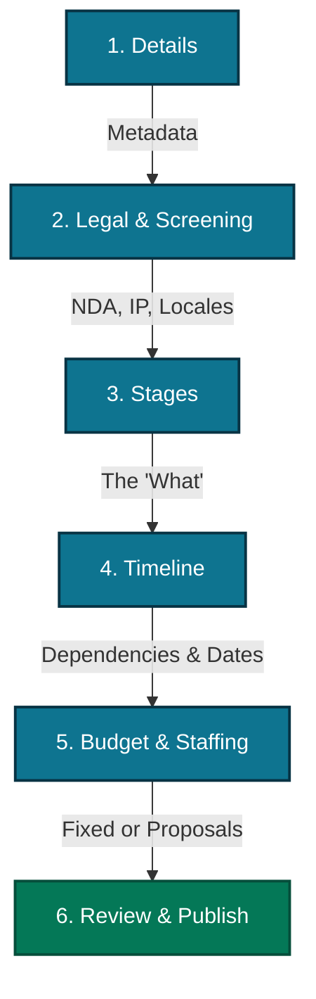

# Project Creation Engine & Stage Architecture

This document defines the structural flow for project creation, the strict behavior of stage
archetypes, and the escrow/refund policies governing them. It serves as the architectural source of
truth for the `projects` and `finance` schemas.

> **Reconciled with the shipped implementation (2026-09-02).** The six-step flow below is the
> architecture the wizard at `/projects/create` implements. Where an earlier revision of this
> document asserted a column that does not exist — most importantly the `stage_type` archetype
> discriminator (§6.0) — the assertion is now marked as **not built** rather than left standing.
> Field names below are the Zod SSOT's (`packages/types/projects/create.ts`, `setup.ts`); column
> names are `projects.projects` / `projects.project_stages` in
> [`../database/projects/Tables.md`](../database/projects/Tables.md).

## 1. The 6-Step Project Creation Flow

To prevent cognitive overload and align with the "Modular Project" philosophy, project creation is
decoupled into six distinct phases. This ensures clients define the "What" before negotiating the
"When" and "How Much".



- **Step 1 Details** — high-level metadata: Title, brief, Project Type, Currency, Visibility and
  reference attachments.

- **Step 2 Legal & Screening** — global `ip_ownership_mode`, the NDA mode, portfolio display rights,
  and the language / location screening arrays.

- **Step 3 Stages (the "What")** — the atomic units of work, plus the `hasStages` toggle that
  decides whether this engagement has any. No budgets and no dependencies are mapped here.

- **Step 4 Timeline (the "When")** — sequencing: which stage waits on which, whether it runs in
  parallel, the lag, the per-stage duration model, and the pipeline deadline-bonus offer.

- **Step 5 Budget & Staffing (the "How Much")** — the per-stage price, the seat cap, and (for a
  stage-less engagement) the team roles that replace stages as the staffing model.

- **Step 6 Review & Publish** — the derived readiness ladder and the effective-visibility
  disclosure.

The step keys, their labels and the controls each step owns are the Zod SSOT's `ProjectWizardStep` ·
`WIZARD_STEP_LABEL` · `WIZARD_STEP_FIELDS`, so the rail and the panel cannot name a step
differently.

---

## 2. Project Type, `hasStages`, and the implicit stage

### 2.1 The wizard offers TWO types; the enum keeps three

`ProjectCreateFormat` has three members — `pipeline`, `one_off`, `direct_deliverable` — and the
wizard **offers only the first two**. A Direct Deliverable is not a third choice the author makes:
it is the `hasStages: false` variant of a one-off, which is exactly what the single-task fallback
already describes. The member survives because `projects.structure_variation` stores `single_task`,
because the setup ladder swaps its staffing row from stages to roles on precisely that value, and
because both are reachable from a project the wizard never created.

**Session engagements are not offered here.** `project_format` keeps its `session` member —
`projects.cohorts` / `session_events` / `session_attendance` / `projects.session_kind` all depend on
it — but a session is provider-side and is created from the service composer. The exclusion is at
the offer, never at the enum.

### 2.2 The two-column mapping

`createFormatToColumns(format, hasStages = true)` in `packages/types/projects/setup.ts` is the one
implementation of the fold, called by both fat-service create paths:

| Offered type         | `hasStages` | `projects.format` | `projects.structure_variation` |
| :------------------- | :---------- | :---------------- | :----------------------------- |
| `pipeline`           | `true`      | `pipeline`        | `standard`                     |
| `pipeline`           | `false`     | `pipeline`        | `single_stage`                 |
| `one_off`            | `true`      | `one_off`         | `one_off`                      |
| `one_off`            | `false`     | `one_off`         | `single_task`                  |
| `direct_deliverable` | _(ignored)_ | `one_off`         | `single_task`                  |

### 2.3 `hasStages` is DERIVED and is never a column

Reading back: `hasStages === (structure_variation !== 'single_task')` — `hasStagesFor(structure)`. A
real boolean would be a second answer able to disagree with the stage list itself, and
`projects.set_project_status` already gates `draft → active` on the stage **count**.

The two directions are deliberately **not** inverses, and a test pins the asymmetry: turning stages
off on a `pipeline` yields `single_stage`, which still has a stage, so the read direction correctly
answers `true` for a toggle the author switched off.

### 2.4 The implicit stage is minted by the SERVER

An engagement whose payload names no stage is given one implicit `Delivery` stage by
`projects.create_project`, carrying the project's own description (both halves), its IP mode and —
when `budget_type = 'fixed_price'` — its `budget_amount_cents` as the stage `unit_price_cents`. Its
channel is always opened. The fallback sits **after** the stages loop and outside the roles branch,
so it fires for every stage-less shape rather than only a role-staffed one.

The wizard therefore never blocks on stages (they are T3, §3) and never mints one itself. This is
root `CLAUDE.md` §2 — fat services, dumb islands — winning over an earlier brief that put the
fallback on the frontend.

---

## 3. The tier taxonomy — FORM LOGIC ONLY

Every wizard control carries a tier. `FieldTier` · `FIELD_TIER_MEANING` · `FIELD_TIERS` ·
`fieldTier(field, format)` · `blocksPosting(tier)` live in `packages/types/projects/create.ts`.

| Tier | Meaning          | What it drives                                         |
| :--- | :--------------- | :----------------------------------------------------- |
| T1   | Blocker          | Step progression — the step cannot be left             |
| T2   | Required to post | The publish gate (`blocksPosting` is T1 + T2)          |
| T3   | Recommended      | Hint copy only                                         |
| T4   | Nice to have     | Hint copy only                                         |
| T5   | Conditional      | Hint copy only; rendered only when its condition holds |

**Tiers are never five literal colours.** The theme has token backing for exactly two gate ramps
(`--fld-required-*` danger, `--fld-gate-*` warning); inventing three more breaches
`DESIGN_SYSTEM.md` §B.8.3 / §A.5 and fails the colour-blindness gate. A tier is never rendered as a
colour key, and the tier taxonomy is not a lifecycle — nothing in it reaches
[`../PRODUCT_MANAGEMENT.md`](../PRODUCT_MANAGEMENT.md) §3.1.

**Two controls resolve by shape rather than by preference** (`TierRule` is a `{pipeline, one_off}`
pair for these two and a flat tier for every other field; `direct_deliverable` resolves down the
`one_off` arm because it IS a one-off):

| Field            | `pipeline` | `one_off` | Why                                                                                                   |
| :--------------- | :--------- | :-------- | :---------------------------------------------------------------------------------------------------- |
| `stageUnitPrice` | T2         | T1        | A one-off's single fee IS the engagement; a pipeline's per-ticket rate can be set once work is scoped |
| `stageDuration`  | T5         | T3        | A one-off's schedule is the deliverable's due date; a pipeline's is a per-stage refinement            |

### 3.1 Validation paints on TOUCH, never at rest

A field paints `--danger` / `--warning` only **after blur with a real problem**, and that paint
**clears on focus** in favour of `--focus-ring-shadow`. `status="required"` is never passed at rest,
because it also sets `aria-invalid` and would announce an untouched empty field as an error before
the author has had a turn. The rule is `resolveFieldVerdict` / `useFieldValidation` in
`@projective/ui/fields`; the clear-on-focus divergence from `DESIGN_SYSTEM.md` §A.7.3's "composes
with focus" is recorded at §A.7.5 of that document.

---

## 4. Fields & Constraints

Tier column per §3. "Column" is the `projects.projects` / `projects.project_stages` destination, or
`—` where the payload field is folded rather than stored.

### Step 1 — Details

| Field              | Tier | Zod (`CreateProjectSchema`) | Column                             | Constraints                                                                                                                                                                         |
| :----------------- | :--- | :-------------------------- | :--------------------------------- | :---------------------------------------------------------------------------------------------------------------------------------------------------------------------------------- |
| Project Title      | T1   | `title`                     | `title`                            | 1–160 chars; DB `ck_projects_title_len` checks the **trimmed** length, so three spaces is not a title                                                                               |
| Description        | T2   | `scope`                     | `description` + `description_text` | Max 8000; semantic HTML from `RichTextEditor`. **Both halves are always written** — writing one leaves search and every card blank while the detail page looks correct              |
| Project Type       | T1   | `format` + `hasStages`      | `format` + `structure_variation`   | §2.2. `pipeline \| one_off` offered                                                                                                                                                 |
| Currency           | T2   | `currency`                  | `currency`                         | `^[A-Z]{3}$` in Zod **and** as DB `ck_projects_currency` — a lowercase code is refused by both, so the wizard can say what is wrong while the field is still in front of the author |
| Visibility         | T2   | `visibility`                | `visibility`                       | `public \| invite_only \| unlisted`; default `public`, **requested not stored** (§5)                                                                                                |
| Global Attachments | T5   | `attachmentIds`             | `projects.project_attachments`     | Max 10 `files.items` ids                                                                                                                                                            |

**Not built:** the earlier `Industry Category (uuid, Required)` row. The column
(`industry_category_id`) exists and is nullable; the wizard does not collect it and the ladder does
not wait on it. The earlier `Banner (uuid)` row names **no column at all** on `projects.projects` —
a project's showcase image is resolved from the owner's profile, not stored per project.

### Step 2 — Legal & Screening

| Field                | Tier | Zod                      | Column                        | Constraints                                                                                                          |
| :------------------- | :--- | :----------------------- | :---------------------------- | :------------------------------------------------------------------------------------------------------------------- |
| IP Ownership Mode    | T2   | `ipOwnershipMode`        | `ip_ownership_mode`           | `exclusive_transfer \| licensed_use \| shared_ownership \| projective_partner`                                       |
| NDA mode             | T5   | `ndaMode`                | `nda_mode` (+ `nda_required`) | `none \| platform_standard \| custom`. §4.1                                                                          |
| NDA document         | T5   | `ndaDocumentId`          | `nda_document_id`             | FK → `files.items`, `ON DELETE SET NULL`; permitted **only** when `nda_mode = 'custom'` (`ck_projects_nda_document`) |
| Portfolio Rights     | T4   | `portfolioDisplayRights` | `portfolio_display_rights`    | `allowed \| forbidden \| embargoed`                                                                                  |
| Language Requirement | T4   | `languages`              | `language_requirement`        | Max 20                                                                                                               |
| Location Restriction | T4   | `locations`              | `location_restriction`        | Max 20; empty is "anywhere", which is an answer rather than an omission                                              |

**Not built in the wizard:** `screening_questions`. The `jsonb` column exists and is written by no
create path; a future screening step lands there rather than in a new column.

#### 4.1 The NDA pair

`nda_mode` is authoritative; `nda_required boolean` is its shadow and is **kept** because several
readers already ask it. `create_project` derives it as `nda_required = (nda_mode <> 'none')`
(`ndaRequiredFor`), and `ndaDocumentFor(mode, id)` drops a stale document id on a mode change so the
`ck_projects_nda_document` CHECK cannot be tripped by a mode switch alone.

Three members, not four: "use a document I uploaded before" and "upload a new one" both resolve to
`custom` plus a document id. A fourth member would encode **how the file arrived** rather than what
governs the work.

> ⚠️ **No constraint keeps the pair in step on a direct UPDATE.** `create_project` derives the
> boolean; any other writer that touches one half must touch the other.

### Step 3 — Stages (the "What")

`hasStages` (T2, default `true`) gates the whole step. Per stage:

| Field              | Tier | Zod (`CreateProjectStageSchema`)                  | Column                                                                             | Constraints                                                                                             |
| :----------------- | :--- | :------------------------------------------------ | :--------------------------------------------------------------------------------- | :------------------------------------------------------------------------------------------------------ |
| Stage Title        | T1   | `name`                                            | `name`                                                                             | 1–120 chars                                                                                             |
| Stage Description  | T2   | `description`                                     | `description` + `description_text`                                                 | Max 8000; both halves written                                                                           |
| Task list          | T3   | `tasks`                                           | `default_tasks` (jsonb)                                                            | Max 50, each ≤ 240 chars. Labels only — the checklist a ticket raised against the stage is seeded from  |
| Skills             | T4   | `skills`                                          | `skills text[]`                                                                    | Max 10                                                                                                  |
| Requires files     | T1   | `requiresFiles`                                   | `file_upload_required`                                                             | **Default `true`** (§4.2)                                                                               |
| Allowed file types | T5   | `allowedFileCategories` / `allowedFileExtensions` | `allowed_file_categories files.file_category[]` / `allowed_file_extensions text[]` | Empty or NULL = **all**. Both may be set; a file passes when it satisfies whichever lists are non-empty |
| NDA override       | T5   | `ndaOverride`                                     | `nda_override`                                                                     | §4.3                                                                                                    |
| Milestone          | —    | `milestone`                                       | `milestone`                                                                        | Free text, ≤ 240; WHAT is owed, never WHEN                                                              |

#### 4.2 `requiresFiles` defaults to TRUE in both places

The `00000015` column default **and** `create_project`'s `COALESCE` fallback in `00001100`. The RPC
always supplies an explicit value, so editing the column default alone changes nothing on the create
path — the single most common inert-edit trap in this schema. A stage exists to produce a
deliverable, and the submissions explorer, the review workspace and the escrow release all read a
stage that owes nothing as a stage with nothing to approve.

#### 4.3 `nda_override` stores intent and enforces nothing

Stated plainly: **the column alone changes no behaviour.** The no-download, watermark and owner-only
rules reach three separate readers that consult no stage flag today. Column now, enforcement later.

### Step 4 — Timeline (the "When")

| Field                | Tier                     | Zod                    | Column                      | Constraints                                                                                                                                                                                                                                                                 |
| :------------------- | :----------------------- | :--------------------- | :-------------------------- | :-------------------------------------------------------------------------------------------------------------------------------------------------------------------------------------------------------------------------------------------------------------------------- |
| Depends on           | T1 (conditional)         | `dependsOnStageIndex`  | `start_dependency_stage_id` | An **index** into `stages` on the payload — a stage being sketched has no durable identity yet; the fat service resolves it to an id once the rows exist. Must not be self, and `create_stage` refuses a dependency from another project                                    |
| Parallel             | T5                       | `parallel`             | `parallel`                  | Runs alongside the stage it depends on rather than after it                                                                                                                                                                                                                 |
| Lag days             | T5                       | `lagDays`              | `start_dependency_lag_days` | 0–365                                                                                                                                                                                                                                                                       |
| Duration mode        | T5 pipeline / T3 one-off | `durationMode`         | `file_duration_mode`        | `fixed_deadline \| relative_duration \| no_due_date`, CHECK-constrained. NULL in the column means "the owner has not chosen a timing model", which `no_due_date` (a choice somebody took) does not describe; the fat service normalises NULL → `no_due_date` on the way out |
| Duration days        | ↑                        | `durationDays`         | `file_duration_days`        | Set when `durationMode = 'relative_duration'`                                                                                                                                                                                                                               |
| Due date             | ↑                        | `dueDate`              | `file_due_date`             | Set when `durationMode = 'fixed_deadline'`. **Reuses the existing column** — no new one was added                                                                                                                                                                           |
| Allow deadline bonus | T2                       | `allowDeadlineBonuses` | `allow_deadline_bonuses`    | Pipeline only, enforced by `ck_projects_deadline_bonus_format` as an implication, so it holds for the DEFINER RPCs too. §4.4                                                                                                                                                |

Project-level `timeline_preset`, `target_project_start_date`, `start_trigger_type`,
`fixed_start_date` and `hire_trigger_active` all exist as columns and are written by
`create_project` from the payload's own keys; the wizard does not yet surface controls for them.

#### 4.4 The deadline bonus — two open conflicts, deliberately unresolved

The offer is a boolean and the column is **plural** (`allow_deadline_bonuses`); there is no singular
twin. The **rate** lives in exactly one greppable named constant, `DEADLINE_BONUS_RATE = 0.1` in
`packages/types/projects/create.ts`, and it is never written to the database and never enters a
money path — the money path is `finance.escrows.deadline_bonus_*`.

> ⚠️ **Flagged for a human, not resolved** (root `CLAUDE.md` §8): (a) the +10% figure comes from the
> creation brief and appears in **no** source-of-truth document; (b) `PRODUCT_SPEC.md` assigns the
> Deadline Bonus to **one-off** engagements while the brief makes it **pipeline-only**, which is
> what shipped and what the CHECK now enforces.

### Step 5 — Budget & Staffing (the "How Much")

| Field          | Tier                     | Zod              | Column                                | Constraints                                                                                                                                                                   |
| :------------- | :----------------------- | :--------------- | :------------------------------------ | :---------------------------------------------------------------------------------------------------------------------------------------------------------------------------- |
| Stage price    | T2 pipeline / T1 one-off | `unitPriceCents` | `unit_price_cents`                    | Minor units, non-negative (CHECK). §4.5                                                                                                                                       |
| Seats          | T2                       | `seatLimit`      | `seat_limit`                          | `NULL` = **Unlimited**; `DEFAULT 3` = limited; `CHECK (> 0)`. **Absent and `null` mean different things** on the payload — absent takes the default 3, `null` means unlimited |
| Team roles     | T2                       | `roles[]`        | `projects.stage_staffing_roles`       | Max 20. The staffing model a **stage-less** engagement takes instead of stages (`staffedByRoles(structure)`)                                                                  |
| Project budget | —                        | `budget`         | `budget_type` + `budget_amount_cents` | `fixed_price \| hourly_cap`; a `NULL` amount is "not priced yet", which is a different fact from zero                                                                         |

#### 4.5 The stage price reuses `unit_price_cents`

A one-off stage is a one-ticket stage, so its fixed price **is** the unit price. A second column
would give "what does this stage cost" two answers while `finance.fn_hold_ticket_escrow` silently
reads only one of them — the money-hole class of root `CLAUDE.md` §8 Decision #84. The reuse is
deliberate and is flagged as a reuse. The folded `CHECK (unit_price_cents IS NULL OR >= 0)` is not
decorative: a negative price was storable and flowed straight into an escrow hold, where it inverts
the direction the money moves.

`stage_open_seats` (`description_of_need`, `budget_min_cents` / `budget_max_cents`,
`require_proposals`) remains the marketplace-bid shape and is not written by the wizard.

### Step 6 — Review & Publish

No controls of its own (`WIZARD_STEP_FIELDS.review` is empty). It renders two derived things:

- **The readiness ladder** — `setupSteps` / `setupCompleteness` / `previewReady` /
  `outstandingSteps` in `packages/types/projects/setup.ts`. Seven rows (Title · Project type ·
  Description · Pricing · Stages-or-Roles · Rules · Publish), of which four are `required`. The
  Stages row swaps to a Roles row on `single_task`. The percentage is rounded once, at the one place
  it is computed, so the bar's `aria-valuenow`, its visible `NN%` and its geometry are the same
  number.
- **The effective-visibility disclosure** (§5).

The draft is created at `status = 'draft'`; publication is
`projects.set_project_status(…, 'active')` and needs a title and **≥ 1 stage** — which §2.4's
implicit stage guarantees for every project the RPC creates.

---

## 5. Effective visibility

The wizard's control **defaults to `public`**. What is **stored** is
`effectiveVisibility(requested, steps)`: the request is honoured only once every `required` ladder
step is done, and until then the project is `unlisted` — reachable by its owner and by anyone
holding the link, absent from Explore.

- It is computed **server-side**, beside the ladder, and called by **both** the wizard's disclosure
  and the fat service that writes the row, so the sentence an author reads under the control and the
  value the database receives are one decision rather than two implementations that agree today.
- A freshly created project has satisfied nothing, so **create still stores `unlisted`** —
  `projects.create_project` hardcodes it, and the security fix that made visibility
  non-payload-readable (root `CLAUDE.md` §8 Decision #85(B)) is preserved, not reversed.
- `unlisted` is returned rather than the author's choice being **rejected**: a refusal would block a
  draft, and the whole point of the ladder is that a project can be saved long before it is offered.

> ⚠️ **Flagged:** `projects.projects.visibility` still carries the column default `public`, which
> only a writer that omits the column would ever see. Every path in this codebase supplies it.

---

## 6. Stage Archetypes & Escrow Policies

### 6.0 There is no `stage_type` column — reconciliation

An earlier revision of this document specified a required `stage_type` enum
(`file_based | session_based | maintenance_based | management_based`) discriminating the archetypes
below, with type-conditional advanced settings. **It was never built, and it is not in the schema.**
`projects.project_stages` has no `stage_type`, no `management_contract_mode` and no
`maintenance_cycle_interval` column; `projects.maintenance_contracts` is a per-freelancer retainer
contract, not a stage archetype configuration.

What exists instead: **every archetype's configuration columns coexist unconditionally on the one
`project_stages` row** — `file_*` (revisions, duration mode, duration days, due date), `session_*`
(duration minutes, count, preferred days, end date), and the pricing/dependency columns shared by
all of them. A stage's archetype is therefore currently **implicit in which columns the owner
filled**, and the wizard collects the file-based set only.

The escrow policies in §6.1–§6.4 remain the governing business rules and are unchanged;
[`../business/PRODUCT_SPEC.md`](../business/PRODUCT_SPEC.md) §Escrow is their SSOT. They are
recorded here as the behaviour a future `stage_type` discriminator would select between — not as
behaviour the current schema can dispatch on.

### 6.1 File-Based Stages

Used for transactional delivery of digital assets (CREATE Category: Create, Run).

Proof of Work: A final submission is uploaded and the client clicks "Approve".

Escrow & "Fair Exit" Policy: Funds are locked in escrow upon hire. If the stage is cancelled early,
a time-based split applies:

```
stateDiagram-v2 [*] --> EscrowFunded: Client Approves Hire EscrowFunded --> ActiveWorkspace

state ActiveWorkspace {
    [*] --> Under25Percent
    Under25Percent --> Between25And75: Time Elapses
    Between25And75 --> Over75Percent: Time Elapses
}

ActiveWorkspace --> Cancelled

state Cancelled {
    direction LR
    c1: Client gets 100% Refund (Talent 0%)
    c2: 50/50 Split (Shared Accountability)
    c3: Talent gets 100% Payout (Substantially Complete)
}

Under25Percent --> c1: Cancel Triggered
Between25And75 --> c2: Cancel Triggered
Over75Percent --> c3: Cancel Triggered

ActiveWorkspace --> Submitted: Talent Uploads Work
Submitted --> Approved: Client Accepts
Approved --> [*]: Payout Released to Talent
```

Configuration (all shipped columns): `file_revisions_allowed`, `file_duration_mode` (fixed vs
relative vs none), `file_duration_days`, `file_due_date`, plus the Step 3 delivery contract —
`file_upload_required`, `allowed_file_categories`, `allowed_file_extensions`.

### 6.2 Session-Based Stages

- Used for consulting, tutoring, or live reviews (CREATE Category: Educate, Advise).

- Proof of Work: Scheduled sessions are completed and logged by the system.

- Escrow & Refund Policy:

  - Client Cancellation (< 24h): Freelancer receives a 50% cancellation penalty.

  - Talent Cancellation: Client receives a 100% refund for all remaining unheld sessions.

- Configuration: `session_duration_minutes`, `session_count`, `session_preferred_days`,
  `session_end_date` (all shipped columns). Not reachable from the project wizard — a session
  engagement is created provider-side (§2.1).

### 6.3 Maintenance-Based Stages

- Used for recurring retainers (CREATE Category: Run, Test).

- Proof of Work: Completion of the maintenance cycle without an open dispute.

- Escrow & Refund Policy: Utilizes a "Negative Confirmation" model. Funds release automatically at
  the end of the interval if no dispute is filed within 48 hours. If the client's wallet lacks funds
  3 days before the cycle ends, the system automatically pauses the stage.

- Configuration: **not built as a stage column.** The interval lives on
  `projects.maintenance_contracts.billing_interval`, which is a contract between a freelancer and a
  business rather than a property of a stage. A stage-level `maintenance_cycle_interval` does not
  exist.

### 6.4 Management-Based Stages

- Oversight stages typically mapped to project managers.

- Proof of Work: Dependent on the successful delivery of underlying stages.

- Configuration: **not built.** `management_contract_mode` (`fixed_dates | duration_from_start`)
  exists in no migration. The nearest shipped equivalent is the stage's own `start_trigger_type` +
  `file_duration_mode` pair.

---

## 7. Lifecycle, Kanban & Submissions State Machines

> Implemented in migrations `0119_project_lifecycle.sql`, `0120_submissions_engine.sql`,
> `0121_kanban_sync.sql`, `0122_project_card_summary.sql`, `0303_projects_lifecycle_rls.sql`. All
> mutations flow through SECURITY DEFINER `projects.*` RPCs (finance stays unexposed) and are called
> from FreshJS services (`ProjectLifecycleService*`, `SubmissionsService*`, `TicketsService*`).

### 7.1 Project Lifecycle (`projects.set_project_status`)

Owner-only transitions over the `project_status` enum, recorded to
`projects.project_status_history`:

| From                         | To        | Validation gate                                                        |
| ---------------------------- | --------- | ---------------------------------------------------------------------- |
| draft / on_hold              | active    | Project must have a title **and ≥ 1 stage**                            |
| active / on_hold             | completed | **Every ticket terminal** (completed/cancelled) **and no held escrow** |
| active                       | on_hold   | Owner discretion                                                       |
| draft/active/hold            | cancelled | Owner discretion                                                       |
| draft/active/hold            | archived  | Soft deletion; writes `archived_at` in the same statement              |
| completed/cancelled/archived | _(any)_   | Rejected — terminal states are immutable                               |

### 7.2 Kanban Synchronization (`projects.move_ticket` + `trg_ticket_review_submission`)

Columns are the `ticket_status` enum (Backlog=backlog, To Do=todo, In Progress=in_progress/claimed,
Review=in_review, Done=completed).

- **→ Review**: an `AFTER UPDATE` trigger auto-generates a `stage_submissions` ledger row for the
  ticket's current stage (idempotent with an explicit `submit_deliverable`).
- **→ Done**: requires **client/owner review authority** (`projects.can_review_project`); a
  freelancer cannot self-confirm delivery. Confirming a Done move settles the installment (existing
  escrow-sync trigger) and logs a `milestone_confirmed` activity. Every move is written to
  `ticket_history`.

### 7.3 Submissions & Deliverables (`submit_deliverable` / `review_submission`)

- **Submit** (freelancer / project participant): files a deliverable + links already-uploaded file
  ids and pushes the ticket into Review. Status vocabulary:
  `draft | pending_review | accepted |
  revisions_requested`.
- **Review** (client / owner only, guarded by `projects.can_review_project`): `accept` → `accepted`;
  `request_revision` → `revisions_requested`, opens a `stage_revision_requests` row and bounces the
  ticket back to In Progress.

### 7.4 Quick-Inspector metadata (`projects.get_project_card_summary`)

Single guarded read powering the Unified Card / Split-Pane inspector: lifecycle status, live Kanban
column counts, `pending_submissions` warning count, unsettled `held_escrows`, and the next milestone
deadline (soonest future ticket due date or stage file due date).

---

## 8. Where creation happens

`/projects/create` under `routes/(dashboard)/` renders the wizard; it is guarded, and it must stay a
**static** sibling of `[projectId]` so `create` is never captured as a project slug. See
[`../architecture/ROUTING.md`](../architecture/ROUTING.md).

The write is one RPC — `projects.create_project(payload jsonb) RETURNS jsonb {id, slug}` — which
inserts the project, its stages, their staffing roles, the participant row, the implicit stage when
there is none, the project channel and a readable unique slug **in a single transaction**. Owner,
status and visibility are set by the function from `auth.uid()`, never from the payload.
