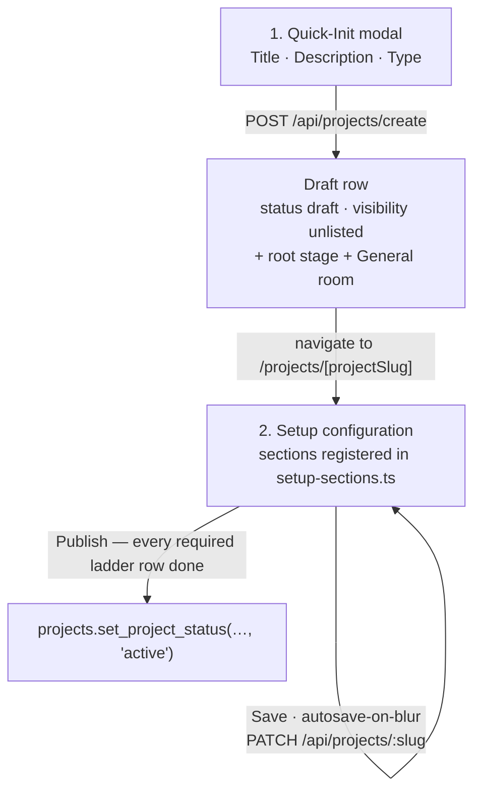

# Project Creation Engine & Stage Architecture

This document defines the structural flow for project creation, the strict behavior of stage
archetypes, and the escrow/refund policies governing them. It serves as the architectural source of
truth for the `projects` and `finance` schemas.

> **Reconciled with the shipped implementation (2026-10-05).** This pass rewrote §1–§5 against the
> code. The six-step wizard at `/projects/create` is **retired** — the route only answers `308 →
> /projects` — and creation is now a Quick-Init modal followed by continuous configuration on the
> draft's own workspace (§1; root `CLAUDE.md` §8 Decisions #85, #117, #118). Everything the earlier
> revision cited from the wizard — `ProjectWizardStep`, `WIZARD_STEP_LABEL`, `WIZARD_STEP_FIELDS`,
> the `FieldTier` / `FIELD_TIERS` / `fieldTier` / `blocksPosting` / `TierRule` taxonomy,
> `CreateProjectStageSchema`, `effectiveVisibility`, the `direct_deliverable` create format — no
> longer exists, and neither do the `ck_projects_title_len`, `ck_projects_currency` and
> `ck_projects_deadline_bonus_format` CHECKs it described. The live create path does not call
> `projects.create_project` (§2.4), there is no `nda_mode` column (§4.3), and
> `file_upload_required` defaults to `false` at the column (§4.1). The 2026-09-02 pass's `stage_type`
> reconciliation (§6.0) is unchanged. Field names below are the Zod SSOT's
> (`packages/types/projects/create.ts`, `setup.ts`); column names are `projects.projects` /
> `projects.project_stages` in [`../database/projects/Tables.md`](../database/projects/Tables.md).

## 1. The 2-Step Project Creation Flow

"Quick to onboard, slow to set up." The create payload is deliberately the **smallest** shape that
can mint a coherent draft; everything a project eventually needs is configured afterwards on the
draft itself. The split is not stylistic: a modal that collects a stage list has to be closed before
the owner can look anything up, and a half-filled one loses everything on dismiss — a draft row
loses nothing. So the modal's only job is to reach a URL, and the URL is where the work happens.


```mermaid
flowchart TD
    A["1. Quick-Init modal<br/>Title · Description · Type"] -->|"POST /api/projects/create"| B["Draft row<br/>status draft · visibility unlisted<br/>+ root stage + General room"]
    B -->|"navigate to /projects/[projectSlug]"| C["2. Setup configuration<br/>sections registered in setup-sections.ts"]
    C -->|"Save · autosave-on-blur<br/>PATCH /api/projects/:slug"| C
    C -->|"Publish — every required ladder row done"| D["projects.set_project_status(…, 'active')"]
```

### 1.1 Step 1 — the Quick-Init create modal

`apps/web/features/projects/components/ProjectCreateModal.tsx` is the **one** surface that mints a
project, wherever the client starts from (Decision #117). Its fields:

- **Title** — required; trimmed, 3–160 characters (§4 Basics).
- **Description** — optional plain text, ≤ 2000; stored as one escaped paragraph so the workspace
  opens on the sentence the client already wrote.
- **Type** — Task · One-off · Pipeline (`ProjectTypeChoice`, labels `PROJECT_TYPE_LABEL`, hints
  `PROJECT_TYPE_HINT`; §2).
- **Invited freelancer** — contextual and read-only, rendered only when the modal is opened from a
  seller's `/[handle]` profile. It is displayed, not sent (Decisions #117(c) / #118(c)).

**Pacing** is a prop, never a second modal (Decision #118): `flow: "single"` on the `/projects` lane,
whose create menu has already settled the type (the selector can still change it), and
`flow: "stepped"` on a profile, where the type gets its own neutral first screen and the details
follow.

**Not asked:** currency and a baseline price (Decision #117, not reversed by #118). The payload still
carries `currency` — seeded from the viewer's resolved money context through `toDisplayCurrency`,
because it prices escrow for the life of the engagement — and sends `baselineAmountCents: null`; both
are changed later in the workspace.

The payload is `CreateProjectSchema` (`packages/types/projects/create.ts`), its `format` + `hasStages`
pair produced by `createInputForType(type)`. `ProjectSidebarService.create` posts it to
`POST /api/projects/create` → `ProjectBackendService.create` → `insertProject`
(`packages/backend/services/projects/live-writes.ts`) on the live path, or the stub write-store
otherwise. It returns `CreatedProjectSchema` `{ id, slug }`, and the modal navigates by **slug**
(Decision #88).

### 1.2 Step 2 — continuous configuration on the workspace

The draft is configured at `/projects/[projectSlug]/details`, the owner's configuration of the
engagement (Decision #144). While the project is a draft, the engagement's root forwards its owner
there with a `303`; once it is published the root is the engagement's **Overview** (§1.3), and
`/details` stays one link away in the Overview's header band and the lane's footer.
`/projects/[projectSlug]/edit` and `/settings` are `308` shims to `/details`. The sections are
registered once in `apps/web/features/projects/core/setup-sections.ts` (`setupSections(setup)`,
anchors `psu-<key>`), so the form and its side nav cannot disagree. In render order:

| Section (`SetupSectionKey`)          | Rendered when                                                                                                          | Collects                                                                                                                                                                  |
| :----------------------------------- | :--------------------------------------------------------------------------------------------------------------------- | :------------------------------------------------------------------------------------------------------------------------------------------------------------------------ |
| `basics` — Basics                    | always                                                                                                                 | Project name · Project type (Task · One-off · Pipeline) · Session kind, only on an existing session engagement                                                            |
| `description` — Description          | always                                                                                                                 | The rich-text brief                                                                                                                                                       |
| `details` — Details                  | a **flat** engagement — stage-less but not role-staffed (the legacy `single_stage` shape)                             | The root stage's terms, asked flat (`pricedStages` collects the root stage only)                                                                                         |
| `budget` — Budget                    | `pricedAtProjectLevel(structure)` — only `single_task`, the one shape with no stage to carry a price                  | Budget type and amount                                                                                                                                                    |
| `stages` — Stages / Milestones       | a staged run (`stageListVisible`); headed by `STAGE_SECTION_LABEL` — "Stages" on a pipeline, "Milestones" on a one-off | The per-stage editor (§4 Stages)                                                                                                                                          |
| `roles` — Team roles                 | `structure === 'single_task'`, instead of `stages`                                                                     | Named roles for a stage-less engagement                                                                                                                                   |
| `attachments` — Attachments          | always                                                                                                                 | Reference files                                                                                                                                                           |
| `rules` — Terms & visibility         | always                                                                                                                 | Visibility on publish · Timeline preset (only when `timelinePresetApplies`) · Locations · Languages · **Advanced options**: NDA · Currency · Ownership · Portfolio rights · deadline bonus (pipeline only) |

**Saving.** The client state machine is `apps/web/features/projects/core/setup-state.ts` (the working
copy and baseline live in its leaf `setup-store.ts`). Every local edit is folded through
`reconcileSetup` — the same function the fat service calls — so the progress bar the owner watches
while typing and the gate the server derives on save are one implementation. Persistence is an
explicit **Save** (button or `Ctrl+S`) plus an optional **autosave-on-blur** (`autoSaveOnBlur`,
per-device preference `setAutoSave`); overlapping saves collapse (`requestSave`), a blur on an
unchanged draft costs nothing, and a refused autosave is not retried until the next edit. Writes go
to `PUT | PATCH /api/projects/:slug` with `UpdateProjectSchema` (`setup.ts`).

**Publishing.** `publishSetup` refuses while `firstBlocker` names a problem or `previewReady` is
false (§3), then sends the whole form with `status: 'active'`; the fat service runs the transition
through `projects.set_project_status`, which owns its legality and audit row (§7.1).

### 1.3 After publish — the engagement's Overview

Once published, `/projects/[projectSlug]` is the engagement's **Overview** for its owner and every
participant (Decision #144): what needs the viewer, where each stage stands, the rooms and the
people. Who reaches it is one pure rule, `landingFor(access, status)` in
`packages/types/projects/access.ts`, over two server facts — the viewer's `viewerAccess` (owner ·
participant · prospect, from `projects.has_project_access`) and the project's status. The owner's
draft forwards to `/details`; a prospect on any workspace path is sent to the public listing. The
addresses and redirects are tabled in [`ROUTING.md`](../architecture/ROUTING.md).

The page is composed, not read: `ProjectBackendService.workspace` folds the overview, board, roster
and (for the owner) setup reads through the pure `composeWorkspace`
(`packages/types/projects/workspace.ts`). "Needs you" for the owner lists submissions to review,
applications to decide and stages that still need a price — the last counted with the setup
ladder's own `pricedStages`, so the Overview and the ladder agree about which stages are meant. A
participant sees returned work to revise and claimed work to deliver.

---

## 2. Project types, `hasStages`, and the root stage

### 2.1 Three types, two columns

The product offers **three** types everywhere a project is created or configured —
`ProjectTypeChoice = task | one_off | pipeline` (`packages/types/projects/setup.ts`; Decision #117,
being re-confirmed as Decision #143). A row stores them as two axes: `projects.format`
(`project_format`) and `projects.structure_variation` (`ProjectStructure`).

- **Task** — one deliverable, one price, no stages: a one-off with milestones off. Held by
  `fn_enforce_structure_variation` to exactly one stage and one ticket, so it has no time axis to
  draw — no Timeline or Calendar (`isTaskProject`; Decision #121). Staffed by optional Team roles
  and priced at project level.
- **One-off** — a fixed scope delivered against milestones (a staged one-off), visualised on the
  Timeline. Each milestone's price is its whole fee, and the project budget is their sum
  (`rolledUpBudget`).
- **Pipeline** — ongoing work, ticket by ticket, across stages: the multi-stage Kanban engine. Its
  stage price is a per-ticket rate and is never summed into the project budget; the lane drops
  Timeline (Decision #134).

`ProjectCreateFormat` is now `one_off | pipeline` only. **`direct_deliverable` is retired** as a create
vocabulary: it had to be stored as `one_off` + `single_task` anyway, so the mapping onto
`project_format` is the identity and the distinction survives one level down as `single_task`. (The
`marketplace.service_delivery_model` enum still carries a `direct_deliverable` member; that is the
services domain, not this one.)

**Session engagements are not offered here.** `project_format` keeps its `session` member —
`projects.cohorts` / `session_events` / `session_attendance` / `projects.session_kind` all depend on
it — but a session is provider-side and is created from the service composer. The exclusion is at
the offer, never at the enum: `projectTypeOf` answers `null` for a session, and the setup form
appends a session option only to a project that already is one.

### 2.2 The mapping

Write direction: `createInputForType(type)` → `[ProjectCreateFormat, hasStages]` →
`createFormatToColumns(format, hasStages)` → `{ format, structure }`. `columnsForProjectType(type)` is
that composition, used by the setup form's type selector; the create modal sends the same pair, so a
Task minted from a profile and a Task chosen in settings are the same row.

| Type       | `createInputForType` | `projects.format` | `projects.structure_variation` | `fn_enforce_structure_variation` (`00001130`)    |
| :--------- | :------------------- | :---------------- | :----------------------------- | :----------------------------------------------- |
| `task`     | `["one_off", false]` | `one_off`         | `single_task`                  | ≤ 1 stage **and** ≤ 1 ticket                     |
| `one_off`  | `["one_off", true]`  | `one_off`         | `one_off`                      | ≤ 1 ticket **per project** — see the flag below |
| `pipeline` | `["pipeline", true]` | `pipeline`        | `standard`                     | unconstrained                                    |

Read direction, `projectTypeOf(format, structure)` — total over every stored pair, including two the
create path can no longer produce:

| `format`   | `structure_variation`                  | Reads as   |
| :--------- | :------------------------------------- | :--------- |
| `one_off`  | `single_task`                          | `task`     |
| `one_off`  | `single_stage` (legacy flat one-off)   | `task`     |
| `one_off`  | `one_off` / `standard`                 | `one_off`  |
| `pipeline` | any, including legacy `single_stage`   | `pipeline` |
| `session`  | any                                    | `null`     |

`createFormatToColumns("pipeline", false)` still returns `single_stage`, but no surface asks for it:
`createInputForType` never yields that pair, and the setup form's old has-stages toggle
(`structureForStages`) is retired, so `single_stage` is unreachable going forward. Rows already
holding it keep rendering (as the `details` section) through `hasStages`.

> **One master ticket, many milestones.** `fn_enforce_structure_variation` raises "One-off projects
> are limited to a single ticket" once a `structure_variation = 'one_off'` project holds more than
> one ticket — a **project-wide** count. That is the One-off model (`PRODUCT_SPEC.md` §The Three Work
> Flows, Decision #143): the single master ticket travels the milestone stages through its
> `required_stages`, and each stage it enters is priced and escrowed against that same ticket. A
> Task differs only in having one stage. ⚠️ No seeded one-off has more than one stage (verified
> 2026-10-05), so the multi-milestone path is exercised by no fixture.

### 2.3 `hasStages` is DERIVED and is never a column

Two predicates read the stored structure; neither is a column. `hasStagesFor(structure)` —
`structure !== 'single_task'` — is the read direction of `createFormatToColumns` (used by
`core/sidebar-overlay.ts`). `hasStages(structure)` additionally excludes `single_stage`, and it is what
the setup sections, the ladder and the pricing rules branch on. A real boolean would be a second
answer able to disagree with the stage list itself, and `projects.set_project_status` already gates
`draft → active` on the stage **count**.

The two directions are deliberately **not** inverses, and `packages/backend/services/projects/create_test.ts`
pins the asymmetry: `createFormatToColumns("pipeline", false)` yields `single_stage`, which still has a
stage, so `hasStagesFor` correctly answers `true` for it.

### 2.4 The root stage is minted by the fat service

`insertProject` (`live-writes.ts`) **does not call `projects.create_project`** — its docblock records
why (the RPC reads the row id from its payload, supplies no budget pair, and its nested stage insert
drops the price and milestone). It inserts the row directly under RLS (`"Users can create projects"`,
`WITH CHECK (auth.uid() = owner_user_id)`) at `status = 'draft'`, `visibility = 'unlisted'`,
`publish_visibility = 'public'` (§5), `budget_type = 'fixed_price'` and `budget_amount_cents` = the
baseline on a one-off (otherwise `NULL`; the modal sends `null`). Then:

1. `projects.create_stage` mints **one root stage** — `Delivery` on a one-off (Task included),
   `Stage 1` on a pipeline (`ROOT_STAGE_NAME`) — with an empty scope and
   `unit_price_cents = baselineAmountCents`. `create_stage` provisions the stage's room in the same
   transaction, which is why it is used rather than a direct insert.
2. `comms.get_or_create_project_channel(project, NULL, 'General')` opens the project-wide room behind
   `/projects/[slug]/discussion` (Decision #133).

There is **no transaction across the statements**. A failed stage or room insert is warned, not
raised: the owner still gets their draft, the `stages` ladder row says what is missing, and
`set_project_status` refuses to activate a project with no stage. The stub write-store mirrors the
one root stage.

`projects.create_project(payload jsonb)` still exists in `00001100_functions_projects_read_access.sql`
(it stores `draft` / `unlisted` and mints an implicit `Delivery` stage), but nothing on the create path
calls it. Either way the island never mints a stage — root `CLAUDE.md` §2, fat services and dumb
islands.

---

## 3. Validation — what gates what

The wizard's five-tier taxonomy was removed with the wizard. Validation is now three mechanisms, each
with one job:

1. **The wire boundary.** `CreateProjectSchema` on create and `UpdateProjectSchema` on every
   `PUT`/`PATCH` (`setup.ts`); the fat service's `validateUpdate` adds the refusals Zod cannot see (a
   stage waiting for itself → `422 self_dependency`, a non-uuid attachment → `unknown_file`), and the
   post-onboarding locks answer `422 field_locked_post_onboarding`. Refusals are field-keyed, so they
   land on the control that caused them.
2. **Save blockers.** `firstBlocker(setup)` in `apps/web/features/projects/core/setup-validation.ts`
   refuses Save and Publish with one sentence for an empty project name, an unnamed stage, an empty
   task-list step or an unnamed role. Autosave-on-blur skips silently instead of painting the form.
3. **The publish gate.** The setup ladder's `required` rows (§4, Readiness ladder): `previewReady`
   must be true before `publishSetup` sends `status: 'active'`, and the same flag unlocks Preview.

Severity is never a colour key. The theme has token backing for exactly two gate ramps
(`--fld-required-*` danger, `--fld-gate-*` warning); inventing more breaches `DESIGN_SYSTEM.md`
§B.8.3 / §A.5 and fails the colour-blindness gate. The ladder is not a lifecycle — nothing in it
reaches [`../PRODUCT_MANAGEMENT.md`](../PRODUCT_MANAGEMENT.md) §3.1.

> ⚠️ **Flagged:** the readiness ladder is enforced on the client. The server-side transition
> (`projects.set_project_status`) checks only a non-blank title and **≥ 1 stage**; it does not
> re-check `pricingSatisfied` or the other `required` rows.

### 3.1 Validation paints on TOUCH, never at rest

A field paints `--danger` / `--warning` only **after blur with a real problem**, and that paint
**clears on focus** in favour of `--focus-ring-shadow`. `status="required"` is never passed at rest,
because it also sets `aria-invalid` and would announce an untouched empty field as an error before
the author has had a turn. The rule is `resolveFieldVerdict` / `useFieldValidation` in
`@projective/ui/fields`; the clear-on-focus divergence from `DESIGN_SYSTEM.md` §A.7.3's "composes
with focus" is recorded at §A.7.5 of that document.

On the setup surface the WHEN is `fieldStatus(fieldKey, verdict)` in `core/setup-validation.ts`: a
verdict shows only once the field has been left (`markTouched`) and never while the caret is in it
(`markFocused`); `success` passes through. Most `@projective/ui` field controls own their focus
handling, so `FieldGuard` reports entry and exit with capture-phase listeners, and a move between two
elements inside one guard (a field and its stepper) is not a departure. `resetFieldValidation`
clears the store on unmount so a second engagement does not inherit the first one's touched keys.

---

## 4. Fields & Constraints

Keyed by setup section (§1.2). "Zod" is the schema field that carries the value today — the
read projection `ProjectSetupSchema` and its parts, written through `UpdateProjectSchema` unless
noted. "Column" is the `projects.projects` / `projects.project_stages` destination; the fold is
`projectColumnPatch` / `stageTermsPatch` / `reconcileStages` / `reconcileRoles` in `live-writes.ts`.

### Basics

| Field        | Zod                                                                       | Column                           | Constraints                                                                                                                                                                                                                                                                                                                                 |
| :----------- | :------------------------------------------------------------------------ | :------------------------------- | :------------------------------------------------------------------------------------------------------------------------------------------------------------------------------------------------------------------------------------------------------------------------------------------------------------------------------------------ |
| Project name | `CreateProjectSchema.title` on create; `UpdateProjectSchema.title` after | `title`                          | Create: **trimmed, 3–160**. Update: 1–160. The column is `text NOT NULL` with **no length CHECK** (there is no `ck_projects_title_len`); `insertProject` clamps to 160. A blank-after-trim title is refused by `firstBlocker` on save, leaves the ladder's Title row undone, and is refused by `set_project_status` (`btrim(title) = ''`) on activation |
| Project type | `ProjectTypeChoice` → `format` + `structure` (`columnsForProjectType`)   | `format` + `structure_variation` | §2.2. **Frozen once anybody is onboarded** (`shapeLocked`, `SHAPE_LOCK_REASON`)                                                                                                                                                                                                                                                            |
| Session kind | `sessionKind` (`ProjectSessionKind`)                                      | `session_kind`                   | Rendered only on an existing session engagement; written `none` for any other format                                                                                                                                                                                                                                                       |

### Description

| Field       | Zod                                                                                                         | Column                             | Constraints                                                                                                                                                                                                                                                                       |
| :---------- | :---------------------------------------------------------------------------------------------------------- | :--------------------------------- | :-------------------------------------------------------------------------------------------------------------------------------------------------------------------------------------------------------------------------------------------------------------------------------- |
| Description | `CreateProjectSchema.description` (plain text ≤ 2000, escaped into one paragraph); `UpdateProjectSchema.description` | `description` + `description_text` | Max 8000; semantic HTML from `RichTextEditor`. **Both halves are always written** — writing one leaves search and every card blank while the detail page looks correct. The ladder's Description row (optional) tests prose with `hasRichTextProse`, so an emptied editor's `<p><br></p>` does not count |

**Not collected:** `industry_category_id` exists and is nullable; no surface collects it and the
ladder does not wait on it. A project has **no banner column** — its showcase image is resolved from
the owner's profile.

### Budget (role-staffed Task only)

| Field       | Zod                             | Column                | Constraints                                                                                                                   |
| :---------- | :------------------------------ | :-------------------- | :---------------------------------------------------------------------------------------------------------------------------- |
| Budget type | `ProjectBudgetSchema.budgetType` | `budget_type`         | `fixed_price \| hourly_cap`                                                                                                   |
| Amount      | `ProjectBudgetSchema.amountCents` | `budget_amount_cents` | Minor units, `CHECK (>= 0)`; `NULL` is "not priced yet", a different fact from zero. Frozen once anybody is onboarded (`projectPriceLocked`) |

On every other shape the Budget section does not render and the project amount is not typed: a
one-off's is **derived** as the sum of its milestone fees on every fold (`rolledUpBudget`), and a
pipeline's is left alone because its stage prices are per-ticket rates.

### Stages / Milestones (and the flat Details section)

Per stage, `StageSetupSchema`. The flat `details` section renders the same fields for the root stage
only. Timing controls render only when `stageTimingApplies` (a staged run with more than one stage).

| Field                 | Zod                                                    | Column                                 | Constraints                                                                                                                                                         |
| :-------------------- | :----------------------------------------------------- | :------------------------------------- | :------------------------------------------------------------------------------------------------------------------------------------------------------------------ |
| Name                  | `name`                                                 | `name`                                 | 1–120; a blank name is a save blocker                                                                                                                               |
| Scope                 | `description`                                          | `description` + `description_text`     | Max 8000; both halves written                                                                                                                                       |
| Price                 | `unitPriceCents`                                       | `unit_price_cents`                     | Minor units, `CHECK (IS NULL OR >= 0)`; per ticket on a pipeline, the whole fee on a one-off; `null` = unpriced. Frozen per stage once a provider joins it (`lockedStagePriceIds`). §4.5 |
| Delivery              | `milestone`                                            | `milestone`                            | Free text ≤ 240 (`MILESTONE_MAX`), column `NOT NULL DEFAULT ''`                                                                                                    |
| Required skills       | `skills`                                               | `skills text[]`                        | ≤ 10 (`MAX_STAGE_SKILLS`), each trimmed, 1–60                                                                                                                       |
| Task list             | `tasks` (`StageTaskSchema`)                            | `default_tasks` (jsonb)                | ≤ 50, each 1–240 chars; an empty step is a save blocker. Labels only — the checklist a ticket raised against the stage is seeded from                              |
| Delivery date         | `deliveryDate`                                         | `file_due_date`                        | ISO date, a **one-off** field (a pipeline stage's timing comes from its predecessor); stored as midnight UTC                                                       |
| Starts                | `dependency` (`sequential \| parallel`)                | `start_trigger_type`                   | Written as `dependent_on_stage` / `on_project_start`                                                                                                               |
| Starts with           | `startsWithId`                                         | `start_dependency_stage_id`            | Never self (`422 self_dependency`), never a cycle — the dropdown offers only `stagePredecessorOptions` (`wouldCycle`); `null` = the stage above                  |
| Delay                 | `delayDays`                                            | `start_dependency_lag_days`            | Signed, ±365 (`STAGE_DELAY_MAX_DAYS`) — a negative lag is a real overlap                                                                                          |
| Capacity · Seats      | `capacity` (`unlimited \| limited`) + `seatCount`      | `capacity` + `seat_count`              | 1–99; a `limited` stage carries a count and an `unlimited` one carries `NULL` — `ck_project_stages_seat_count`, mirrored by `normaliseSeats` (default 3)           |
| Named roles           | `roles[]` (`StageStaffingRoleSchema`)                  | `projects.stage_staffing_roles`        | ≤ 20; name 1–120, quantity 1–99, instructions ≤ 2000; `budgetCents` is a **bonus on top of** the stage price, never a total, and never counted as pricing        |
| Accepted deliverables | `allowedFileKinds`                                     | `allowed_file_kinds text[]`            | ≤ 20; **empty means any**                                                                                                                                           |
| NDA                   | `ndaRequired` (nullable)                               | stage `nda_required`                   | `null` **inherits** the project's `nda_required`; true/false override it for this stage                                                                             |

#### 4.1 `file_upload_required` — false at the column, true through the RPCs

The setup form does not collect it. The `00000015` column default is **`false`**; both
`projects.create_stage` (`00001130`) and `projects.create_project` (`00001100`) fall back to
**`true`** through `COALESCE`. Every stage the shipped paths mint goes through `create_stage`, so in
practice a stage owes a deliverable — but a direct insert gets `false`, and editing the column default
alone changes nothing on the RPC path (the most common inert-edit trap in this schema).

#### 4.2 Legacy stage columns the setup form does not write

`seat_limit` (`DEFAULT 3`, `NULL` = unlimited), `allowed_file_categories` / `allowed_file_extensions`,
`nda_override`, `parallel` and `file_duration_mode` / `file_duration_days` are the stage table's
**older** vocabulary. They exist and `create_stage` reads them from its optional payload, but the
setup form speaks the renamed set above (`capacity` / `seat_count`, `allowed_file_kinds`,
`nda_required`, `start_trigger_type`, `file_due_date`), and `reconcileStages` deliberately does not
send that payload. `nda_override` in particular stores intent and enforces nothing.

### Team roles (role-staffed Task)

| Field      | Zod                                  | Column                          | Constraints                                                                                                                                                                                                                                         |
| :--------- | :----------------------------------- | :------------------------------ | :-------------------------------------------------------------------------------------------------------------------------------------------------------------------------------------------------------------------------------------------------- |
| Team roles | `roles[]` (`ProjectRoleSetupSchema`) | `projects.stage_staffing_roles` | ≤ 20; name 1–120, ≤ 20 skills, instructions ≤ 2000, `budgetCents` a bonus. The staffing model a stage-less engagement takes instead of stages. **Optional on a one-off without milestones** (`teamRolesRequired`): one fixed deliverable may be hired against with no team assembled |

### Attachments

| Field           | Zod                                                     | Column                         | Constraints                                                                                     |
| :-------------- | :------------------------------------------------------ | :----------------------------- | :---------------------------------------------------------------------------------------------- |
| Reference files | `attachments[]` (`ProjectAttachmentSchema`, by `files.items` id) | `projects.project_attachments` | ≤ 10 (`MAX_PROJECT_ATTACHMENTS`); a non-uuid id is refused (`422 unknown_file`) rather than dropped |

### Terms & visibility

`ProjectRulesSchema`, plus the currency, which rides on `ProjectBudgetSchema`.

| Field                 | Zod                                                | Column                     | Constraints                                                                                                                                                                                                                                 |
| :-------------------- | :------------------------------------------------- | :------------------------- | :------------------------------------------------------------------------------------------------------------------------------------------------------------------------------------------------------------------------------------------ |
| Visibility on publish | `visibility`                                       | `publish_visibility`       | `public \| invite_only \| unlisted` — the **intent**, never the live column (§5)                                                                                                                                                           |
| Timeline              | `timelinePreset`                                   | `timeline_preset`          | `sequential \| simultaneous \| staggered \| custom`; rendered only when `timelinePresetApplies` (a staged structure)                                                                                                                       |
| Locations             | `locationRestriction`                              | `location_restriction`     | ≤ 20, each 1–60; empty is "anywhere", which is an answer rather than an omission                                                                                                                                                          |
| Languages             | `languageRequirement`                              | `language_requirement`     | ≤ 20, each 1–60; empty accepts any language                                                                                                                                                                                                |
| Require an NDA        | `ndaRequired`                                      | `nda_required`             | §4.3                                                                                                                                                                                                                                       |
| Which NDA             | `ndaSource` (`NdaDocumentSource`)                  | `nda_source`               | `platform \| custom` (column CHECK, `NOT NULL DEFAULT 'platform'`)                                                                                                                                                                         |
| NDA document          | `ndaDocumentId`                                    | `nda_document_id`          | FK → `files.items`; permitted **only** when `nda_source = 'custom'` (`ck_projects_nda_document`); switching to `platform` nulls it                                                                                                       |
| Currency              | `ProjectBudgetSchema.currency` (`CurrencyCode`)    | `currency`                 | Zod `^[A-Z]{3}$`; the fat service upper-cases it (`normalisedCurrency`) and drops anything still not three letters. The column is `text NOT NULL DEFAULT 'USD'` with **no CHECK** (there is no `ck_projects_currency`). On create, `CreateProjectSchema.currency` only checks length 3 and upper-cases |
| Ownership of the work | `ipOwnershipMode`                                  | `ip_ownership_mode`        | `exclusive_transfer \| licensed_use \| shared_ownership \| projective_partner`                                                                                                                                                             |
| Portfolio rights      | `portfolioDisplayRights`                           | `portfolio_display_rights` | `allowed \| forbidden \| embargoed`                                                                                                                                                                                                        |
| Deadline bonus        | `allowDeadlineBonuses`                             | `allow_deadline_bonuses`   | Pipeline only — §4.4                                                                                                                                                                                                                       |

**Not collected:** `screening_questions` (`jsonb`) exists and is written by no surface; a future
screening step lands there rather than in a new column. `target_project_start_date` likewise exists
on the project with no control.

#### 4.3 The NDA pair

**There is no `nda_mode` column.** The row stores confidentiality as `nda_required` (does one apply)
plus `nda_source` (which instrument), with `nda_document_id` meaningful only under `custom`. The
Terms section edits that pair directly. `NdaMode` (`none | platform_standard | custom`, `create.ts`)
is the vocabulary of the `create_project` RPC's payload only, split across the pair by
`ndaRequiredFor`, `ndaSourceFor` and `ndaDocumentFor`; a `projects.nda_mode` enum **type** exists for
that parse, which is easy to confuse with a column.

Three members, not four: "use a document I uploaded before" and "upload a new one" both resolve to
`custom` plus a document id. A fourth member would encode **how the file arrived** rather than what
governs the work.

> ⚠️ **No constraint keeps `nda_required` and `nda_source` in step.** `nda_required = false` leaves
> `nda_source` meaningless (it keeps its `platform` default and nothing reads it); any writer that
> touches one half must reason about the other.

#### 4.4 The deadline bonus — two open conflicts, deliberately unresolved

The offer is a boolean and the column is **plural** (`allow_deadline_bonuses`); there is no singular
twin. The **rate** lives in exactly one greppable named constant, `DEADLINE_BONUS_RATE = 0.1` in
`packages/types/projects/create.ts` (rendered as `DEADLINE_BONUS_PERCENT` in
`components/setup/setup-format.ts`), and it is never written to the database and never enters a
money path — the money path is `finance.escrows.deadline_bonus_*`.

**Pipeline-only is enforced by the form alone:** the Terms section renders the toggle only when
`format === 'pipeline'`. There is no `ck_projects_deadline_bonus_format` CHECK and `validateUpdate`
does not refuse the field on another format.

> ⚠️ **Flagged for a human, not resolved** (root `CLAUDE.md` §8): (a) the +10% figure comes from the
> creation brief and appears in **no** source-of-truth document; (b) `PRODUCT_SPEC.md` assigns the
> Deadline Bonus to **one-off** engagements while the brief makes it **pipeline-only**, which is
> what shipped.

#### 4.5 The stage price reuses `unit_price_cents`

A one-off stage is a one-ticket stage, so its fixed price **is** the unit price. A second column
would give "what does this stage cost" two answers while `finance.fn_hold_ticket_escrow` silently
reads only one of them — the money-hole class of root `CLAUDE.md` §8 Decision #84. The reuse is
deliberate and is flagged as a reuse. The folded `CHECK (unit_price_cents IS NULL OR >= 0)` is not
decorative: a negative price was storable and flowed straight into an escrow hold, where it inverts
the direction the money moves.

`stage_open_seats` (`description_of_need`, `budget_min_cents` / `budget_max_cents`,
`require_proposals`) remains the marketplace-bid shape and is not written by the setup form.

### Readiness ladder and publish

No section of its own; the ladder renders in the workspace's header band beside the Details ⇄
Preview toggle.

- **The ladder** — `setupSteps` / `setupCompleteness` / `previewReady` / `outstandingSteps`, keyed by
  `ProjectSetupStepKey`, in `packages/types/projects/setup.ts`. Seven rows: Title · Project type ·
  Description · Pricing · Stages-or-Team roles · Rules · Publish. **Required:** Title, Project type
  (done from creation), Pricing (`pricingSatisfied` — every price the shape collects, or the project
  budget on a role-staffed engagement), and the staffing row. The staffing row is Stages (done once a
  stage exists, or at once on a stage-less shape) everywhere except `single_task`, where it is Team
  roles — **optional** on a one-off without milestones (`teamRolesRequired`), so a Task has three
  required rows. Description, Rules and Publish never gate. The percentage is rounded once, at the
  one place it is computed, so the bar's `aria-valuenow`, its visible `NN%` and its geometry are the
  same number; `completeness`, `steps` and `previewReady` are server-derived and never trusted from a
  request body.
- **Publish** — the draft is created at `status = 'draft'`; publication is
  `projects.set_project_status(…, 'active')`, which needs a non-blank title and **≥ 1 stage** — which
  §2.4's root stage provides for every project the shipped path creates. What publishing commits the
  owner to is stated beforehand from `PUBLISH_LOCK_NOTICES`.

---

## 5. Live visibility vs publish intent

Visibility is **two columns** (Decision #85): `publish_visibility` is the owner's **intent** — where
the engagement should sit once it publishes — and `visibility` is where the row sits **now**. One
column cannot hold both: writing the intent to it would publish the draft, and refusing the write
would leave a dropdown that reverts to a value nobody chose.

- **The rule** is `liveVisibilityFor(status, intent)` in `packages/types/projects/setup.ts`: a
  `draft` is `unlisted` **unconditionally**; any other status takes the intent verbatim (including on
  the way back to draft, which re-hides it). It never promotes on readiness alone — a complete draft
  is still a draft, and publishing is an act the owner performs, not a threshold they cross.
- **On create** `insertProject` writes `visibility = liveVisibilityFor('draft',
  CREATED_PUBLISH_VISIBILITY)` — i.e. `unlisted`, reachable by its owner and by anyone holding the
  link, absent from Explore — and `publish_visibility = CREATED_PUBLISH_VISIBILITY` (`public`),
  because somebody creating a project to hire against is asking to be found.
  `DEFAULT_PROJECT_RULES.visibility` (`invite_only`) is only the fallback for a projection
  reconstructed with no create event behind it.
- **On save** the Terms section writes only the intent (`ProjectRulesSchema.visibility` →
  `publish_visibility`). `applyProjectUpdate` promotes it to `visibility` **after**
  `set_project_status` has succeeded, on every save — so a published project's visibility change
  takes effect at once, and on a draft the call re-asserts `unlisted`. The read projection carries
  the live state as `ProjectSetupSchema.liveVisibility`, which `reconcileSetup` re-derives and never
  folds from a payload, so a client cannot publish a draft by asserting it is already public.

> ⚠️ **Flagged:** both `projects.projects.visibility` and `publish_visibility` carry the column
> default `public`, which only a writer that omits them would ever see. Every create path supplies
> both.

---

## 6. Stage Archetypes & Escrow Policies

### 6.0 There is no `stage_type` column — reconciliation

An earlier revision of this document specified a required `stage_type` enum
(`file_based | session_based | maintenance_based | management_based`) discriminating the archetypes
below, with type-conditional advanced settings. **It was never built, and it is not in the schema.**
`projects.project_stages` has no `stage_type`, no `management_contract_mode` and no
`maintenance_cycle_interval` column; `projects.maintenance_contracts` is a per-freelancer retainer
contract, not a stage archetype configuration.

What exists instead: **every archetype's configuration columns coexist unconditionally on the one
`project_stages` row** — `file_*` (revisions, duration mode, duration days, due date), `session_*`
(duration minutes, count, preferred days, end date), and the pricing/dependency columns shared by
all of them. A stage's archetype is therefore currently **implicit in which columns the owner
filled**, and the setup form collects a subset of the file-based set only (`file_due_date`,
`allowed_file_kinds`; §4).

The escrow policies in §6.1–§6.4 remain the governing business rules and are unchanged;
[`../business/PRODUCT_SPEC.md`](../business/PRODUCT_SPEC.md) §Escrow is their SSOT. They are
recorded here as the behaviour a future `stage_type` discriminator would select between — not as
behaviour the current schema can dispatch on.

### 6.1 File-Based Stages

Used for transactional delivery of digital assets (CREATE Category: Create, Run).

Proof of Work: A final submission is uploaded and the client clicks "Approve".

Escrow & "Fair Exit" Policy: Funds are locked in escrow upon hire. If the stage is cancelled early,
a time-based split applies:

```
stateDiagram-v2 [*] --> EscrowFunded: Client Approves Hire EscrowFunded --> ActiveWorkspace

state ActiveWorkspace {
    [*] --> Under25Percent
    Under25Percent --> Between25And75: Time Elapses
    Between25And75 --> Over75Percent: Time Elapses
}

ActiveWorkspace --> Cancelled

state Cancelled {
    direction LR
    c1: Client gets 100% Refund (Talent 0%)
    c2: 50/50 Split (Shared Accountability)
    c3: Talent gets 100% Payout (Substantially Complete)
}

Under25Percent --> c1: Cancel Triggered
Between25And75 --> c2: Cancel Triggered
Over75Percent --> c3: Cancel Triggered

ActiveWorkspace --> Submitted: Talent Uploads Work
Submitted --> Approved: Client Accepts
Approved --> [*]: Payout Released to Talent
```

Configuration (all shipped columns): `file_revisions_allowed`, `file_duration_mode` (fixed vs
relative vs none), `file_duration_days`, `file_due_date`, plus the delivery contract —
`file_upload_required` (§4.1), `allowed_file_kinds` (what the setup form writes) and the legacy
`allowed_file_categories` / `allowed_file_extensions` pair (§4.2).

### 6.2 Session-Based Stages

- Used for consulting, tutoring, or live reviews (CREATE Category: Educate, Advise).

- Proof of Work: Scheduled sessions are completed and logged by the system.

- Escrow & Refund Policy:

  - Client Cancellation (< 24h): Freelancer receives a 50% cancellation penalty.

  - Talent Cancellation: Client receives a 100% refund for all remaining unheld sessions.

- Configuration: `session_duration_minutes`, `session_count`, `session_preferred_days`,
  `session_end_date` (all shipped columns). Not reachable from project creation — a session
  engagement is created provider-side (§2.1).

### 6.3 Maintenance-Based Stages

- Used for recurring retainers (CREATE Category: Run, Test).

- Proof of Work: Completion of the maintenance cycle without an open dispute.

- Escrow & Refund Policy: Utilizes a "Negative Confirmation" model. Funds release automatically at
  the end of the interval if no dispute is filed within 48 hours. If the client's wallet lacks funds
  3 days before the cycle ends, the system automatically pauses the stage.

- Configuration: **not built as a stage column.** The interval lives on
  `projects.maintenance_contracts.billing_interval`, which is a contract between a freelancer and a
  business rather than a property of a stage. A stage-level `maintenance_cycle_interval` does not
  exist.

### 6.4 Management-Based Stages

- Oversight stages typically mapped to project managers.

- Proof of Work: Dependent on the successful delivery of underlying stages.

- Configuration: **not built.** `management_contract_mode` (`fixed_dates | duration_from_start`)
  exists in no migration. The nearest shipped equivalent is the stage's own `start_trigger_type` +
  `file_duration_mode` pair.

---

## 7. Lifecycle, Kanban & Submissions State Machines

> Implemented in the consolidated migrations `00001100_functions_projects_read_access.sql`
> (`set_project_status`, `can_review_project`, `get_project_card_summary`),
> `00001120_functions_projects_ticket_lifecycle.sql` (`move_ticket`, `fn_ticket_review_submission`),
> `00001150_functions_projects_stage_funding_submissions.sql` (`submit_deliverable`,
> `review_submission`, `approve_stage`), `00001820_triggers_projects.sql`
> (`trg_ticket_review_submission`), `00000015_tables_projects.sql` (`project_status_history`) and
> `00002011_policies_projects.sql` (its RLS). All mutations flow through SECURITY DEFINER `projects.*`
> RPCs (finance stays unexposed) and are called from the fat `ProjectBackendService`
> (`packages/backend/services/projects/live-writes.ts`, `live-settlement.ts`); the island-side
> clients are `ProjectSidebarService` and `SubmissionsService` (`apps/web/features/projects/core/`).

### 7.1 Project Lifecycle (`projects.set_project_status`)

Owner-only transitions over the `project_status` enum, recorded to
`projects.project_status_history`:

| From                         | To        | Validation gate                                                        |
| ---------------------------- | --------- | ---------------------------------------------------------------------- |
| draft / on_hold              | active    | Project must have a title **and ≥ 1 stage**                            |
| active / on_hold             | completed | **Every ticket terminal** (completed/cancelled) **and no held escrow** |
| active                       | on_hold   | Owner discretion                                                       |
| draft/active/hold            | cancelled | Owner discretion                                                       |
| draft/active/hold            | archived  | Soft deletion; writes `archived_at` in the same statement              |
| completed/cancelled/archived | _(any)_   | Rejected — terminal states are immutable                               |

### 7.2 Kanban Synchronization (`projects.move_ticket` + `trg_ticket_review_submission`)

Columns are the `ticket_status` enum (Backlog=backlog, To Do=todo, In Progress=in_progress/claimed,
Review=in_review, Done=completed).

- **→ Review**: an `AFTER UPDATE` trigger auto-generates a `stage_submissions` ledger row for the
  ticket's current stage (idempotent with an explicit `submit_deliverable`).
- **→ Done**: requires **client/owner review authority** (`projects.can_review_project`); a
  freelancer cannot self-confirm delivery. Confirming a Done move settles the installment (existing
  escrow-sync trigger) and logs a `milestone_confirmed` activity. Every move is written to
  `ticket_history`.

### 7.3 Submissions & Deliverables (`submit_deliverable` / `review_submission`)

- **Submit** (freelancer / project participant): files a deliverable + links already-uploaded file
  ids and pushes the ticket into Review. Status vocabulary:
  `draft | pending_review | accepted |
  revisions_requested`.
- **Review** (client / owner only, guarded by `projects.can_review_project`): `accept` → `accepted`;
  `request_revision` → `revisions_requested`, opens a `stage_revision_requests` row and bounces the
  ticket back to In Progress.
- **Approve stage** (same authority): offered in the Submissions explorer once a unit is
  `accepted`, behind a confirmation. It releases the stage's held escrow (`projects.approve_stage`).
  Endpoints, payloads and status mapping:
  [`../api/projects-settlement.md`](../api/projects-settlement.md).

### 7.4 Quick-Inspector metadata (`projects.get_project_card_summary`)

Single guarded read powering the Unified Card / Split-Pane inspector: lifecycle status, live Kanban
column counts, `pending_submissions` warning count, unsettled `held_escrows`, and the next milestone
deadline (soonest future ticket due date or stage file due date).

---

## 8. Where creation happens

Creation happens in the Quick-Init modal (§1.1), opened from the `/projects` lane's create menu or a
seller's `/[handle]` profile. `/projects/create` under `routes/(dashboard)/` is a retired `308 →
/projects` shim with no page; it must stay a **static** sibling of `[projectSlug]` so `create` is
never captured as a project slug. See [`../architecture/ROUTING.md`](../architecture/ROUTING.md).

The write is `POST /api/projects/create` → `ProjectBackendService.create` → `insertProject` (§2.4): a
direct RLS-scoped insert of the draft, then `projects.create_stage` for the root stage and
`comms.get_or_create_project_channel` for the General room — **not** one transaction, and **not**
`projects.create_project`, which still exists but is not called. Owner, status and live visibility
are set by the fat service (`owner_user_id = auth.uid()` under the `"Users can create projects"`
policy), never taken from the payload.
